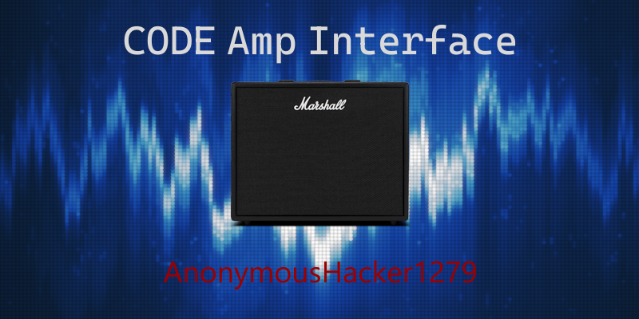

# Marshall CODE Amplifier Interface

### A desktop program to modify amp settings without needing to use the Marshall Gateway app.

The Marshall Gateway app is great, and significantly more convenient than manually adjusting amp dials. But wouldn't
it be great if your computer (which often is your recording station) could double as an amp controller?

Instead of emulating a device to run the Gateway app on your computer, this program directly communicates with the amp
over either a USB or BLE connection.

## How do I use it?

Download the latest installer from
the [releases page](https://github.com/AnonymousHacker1279/MarshallCodeAmpInterface/releases). At this moment, the
project only supports Windows, but Linux support is planned for the future.

## License

This project is MIT licensed. See the [LICENSE](LICENSE) file for more information.

Marshall and Marshall CODE are registered trademarks of Marshall Amplification PLC. Some images contained in this
program are property of Marshall Amplification PLC. This is not an official Marshall product, nor is it endorsed by
Marshall.